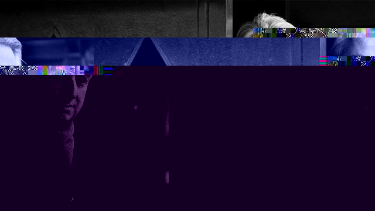
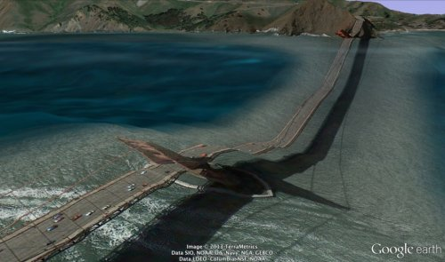
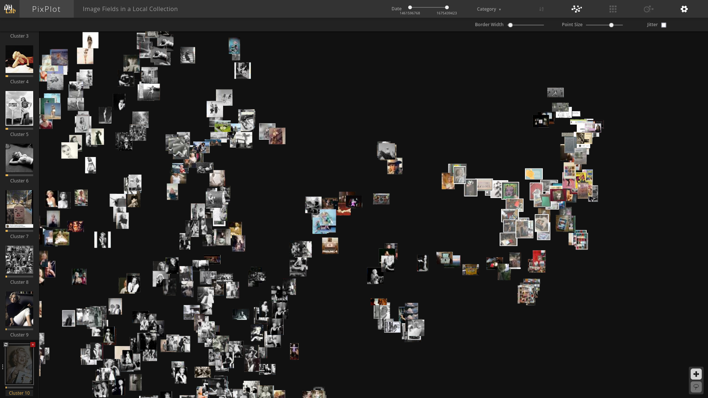
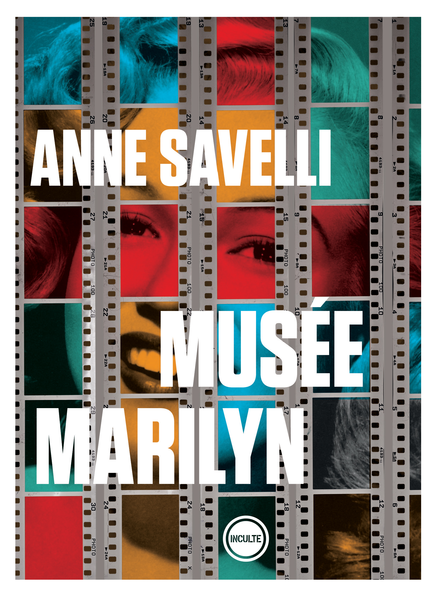
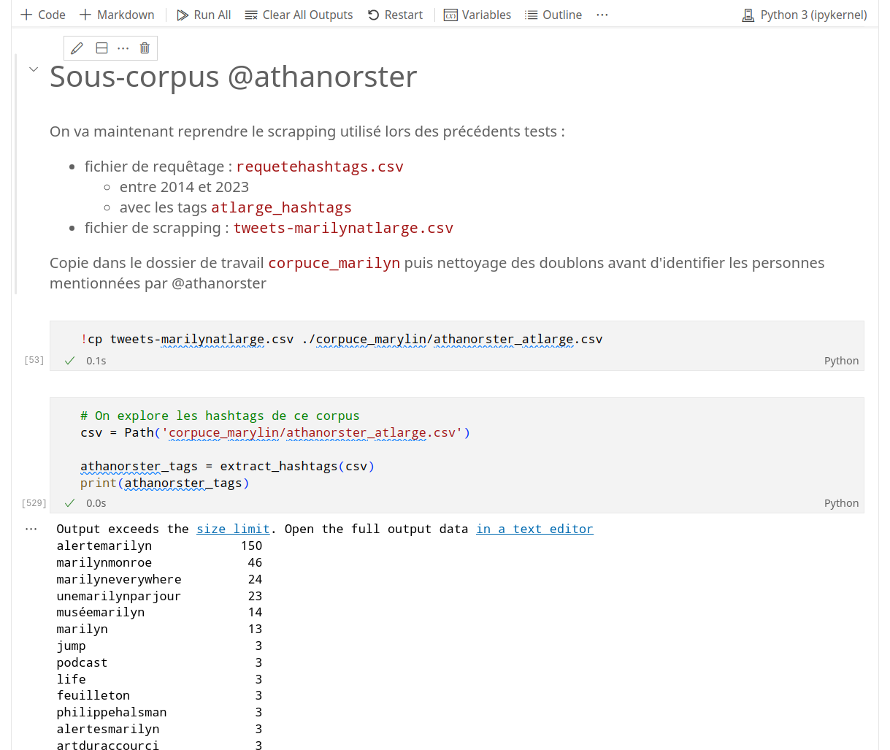
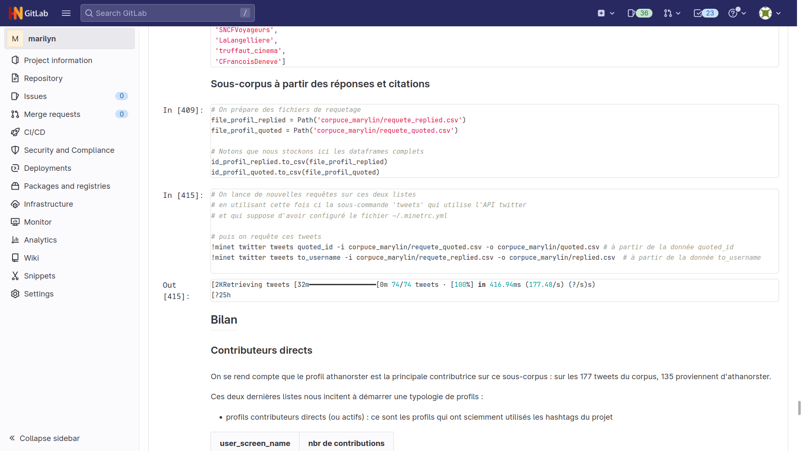
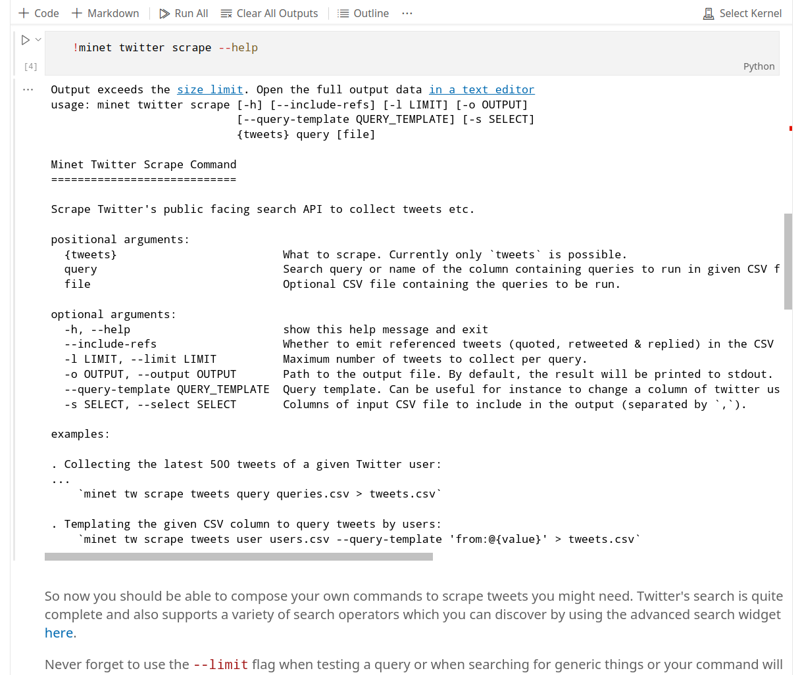
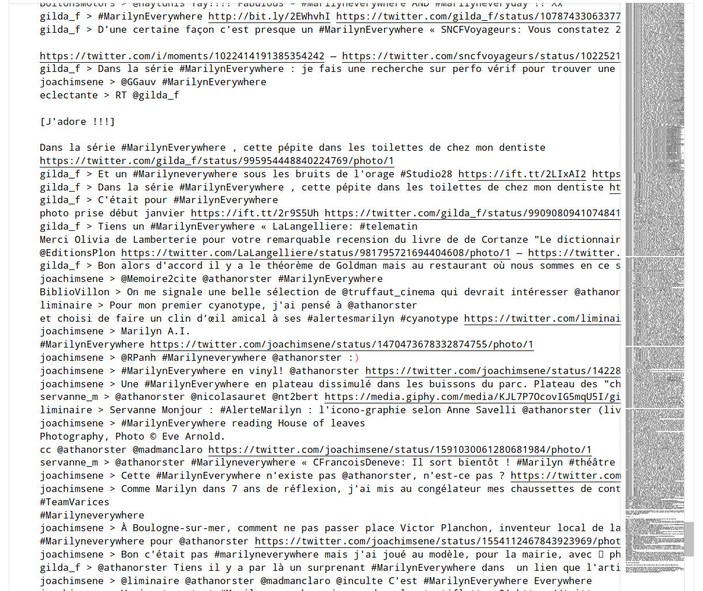
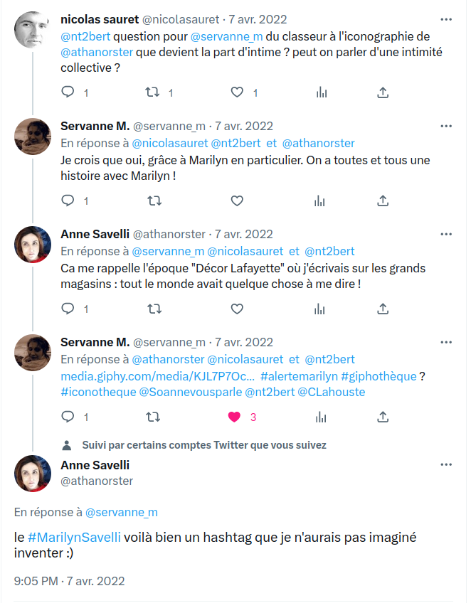
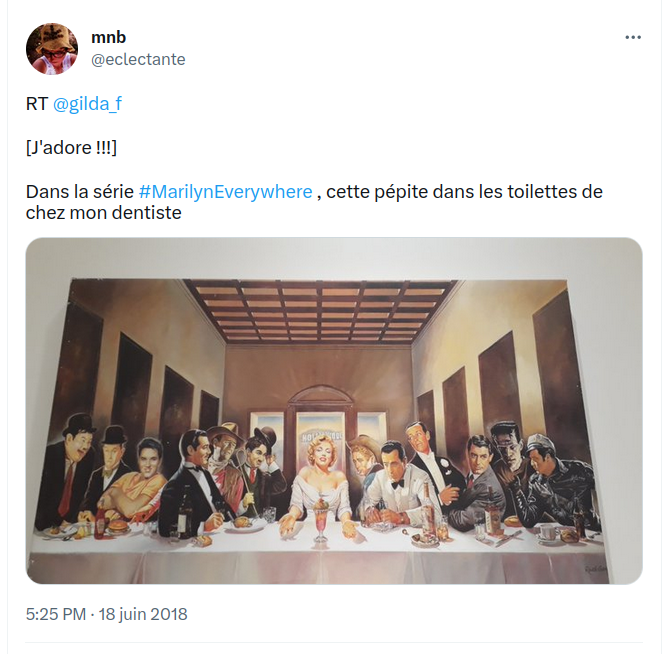

## *Mythologies Postphotographiques*
### Ou la transition numérique en photolittérature 

<!-- .element: style="width:600px" -->

 <!-- .element: class="logo" -->

===

Passage de relai avec JP : la photolittérature contemporaine, marquée par un événement technique + socioculturel : la transition numérique.

Mes recherches portent sur les récits et les pratiques littéraires de l'ère dite post-photographique.

En 2018 j'ai publié un ouvrage intitulé mythologies postphotographiques, adapté de ma thèse (accès libre sur le web). À cette époque, mon corpus restait encore traditionnel : une photolittérature imprimée, produite et diffusée par des canaux éditoriaux classiques. Depuis la parution de ce livre, j'ai basculé plus franchement du côté de la littérature native numérique, produite et diffusée d'abord en ligne, sur des sites web et surtout sur des réseaux sociaux.

Les exemples que j'ai choisi illustrent cette mutation progressive de mon corpus.

§§§§§§§§§§§§§§§§§§§§§§§§§§§§§§§§§§§§§§§§§§§§§

### Prolégomènes   Inventaire avant disparition... 

<!-- .element: style="width:800px" -->

===

Mais avant d'aller plus loin, je vais problématiser un peu mon sujet, avec un texte photolittéraire majeur qui, je crois, est bien connu de la plupart d'entre vous car il a connu un fort succès.

§§§§§§§§§§§§§§§§§§§§§§§§§§§§§§§§§§§§§§§§§§§§§

>Toutes les images disparaîtront. […] Elles s’évanouiront toutes d’un seul coup comme l’ont fait les millions d’images qui étaient derrière les fronts des grands-parents morts il y a un demi-siècle, des parents morts eux aussi. Des images où l’on figurait en gamine au milieu d’autres êtres déjà disparus avant qu’on soit né, de même que dans notre mémoire sont présents nos enfants petits aux côtés de nos parents et de nos camarades d’école. Et l’on sera un jour dans le souvenir de nos enfants au milieu de petits-enfants et de gens qui ne sont pas encore nés. Comme le désir sexuel, la mémoire ne s’arrête jamais. Elle apparie les morts aux vivants, les êtres réels aux imaginaires, le rêve à l’histoire.

<!-- .element: style="font-size:1.3rem; text-align:justify" -->

Annie Ernaux, *Les Années*, 2008.

<!-- .element: style="font-size:1.3rem; text-align:right" -->

===

>Toutes les images disparaîtront. […] Elles s’évanouiront toutes d’un seul coup comme l’ont fait les millions d’images qui étaient derrière les fronts des grands-parents morts il y a un demi-siècle, des parents morts eux aussi. Des images où l’on figurait en gamine au milieu d’autres êtres déjà disparus avant qu’on soit né, de même que dans notre mémoire sont présents nos enfants petits aux côtés de nos parents et de nos camarades d’école. Et l’on sera un jour dans le souvenir de nos enfants au milieu de petits-enfants et de gens qui ne sont pas encore nés. Comme le désir sexuel, la mémoire ne s’arrête jamais. Elle apparie les morts aux vivants, les êtres réels aux imaginaires, le rêve à l’histoire.

C’est sur une étrange prophétie annonçant la disparition des images – textuelles ou visuelles, réelles ou imaginaires – qu'Annie Ernaux ouvre son récit *Les Années*. Comme s’il fallait simultanément démontrer cette précarité de l’image et tenter d’y résister par tous les moyens, à commencer par celui qu’offre l’écriture, Annie Ernaux propose dans ce récit une lecture de son propre album de famille, décrivant minutieusement une série de clichés qui, de 1941 à 2006, composent un autoportrait en retrait de l’auteur, un récit tout à la fois à la fois intime et impersonnel. Portrait d'une génération, *Les Années* racontent également, en creux, une histoire des usages de la photographie au XXe siècle, un média familier, familial peut-être, dont l'avenir parait quelque peu incertain à l'aube d'un nouveau siècle.

§§§§§§§§§§§§§§§§§§§§§§§§§§§§§§§§§§§§§§§§§§§§§

>On passait au lecteur de DVD, à l’appareil photo numérique, au baladeur MP3, à l’ADSL, à l’écran plat, on n’arrêtait pas de passer. Ne plus passer, c’était accepter de vieillir. Au fur et à mesure que l’usure se marquait sur la peau, qu’elle affectait insensiblement le corps, le monde nous abreuvait de choses neuves. […] Avec le numérique, on épuisait la réalité. Sur les photos et les films classés par date qu’on faisait défiler sur l’écran, par-delà la diversité des scènes et des paysages, des gens, se répandait la lumière d’un temps unique. Une autre forme de passé s’inscrivait, fluide, à faible teneur de souvenirs réels. Il y avait trop d’images pour s’arrêter sur chacune et ranimer les circonstances de la prise. Nous vivions en elles d’une existence légère et transfigurée. La multiplication de nos traces abolissait la sensation du temps qui passe.

<!-- .element: style="font-size:1.3rem; text-align:justify" -->

Annie Ernaux, *Les Années*, 2008.

<!-- .element: style="font-size:1.3rem; text-align:right" -->

===

La brusque accélération du récit, dans les vingt dernières pages, donne en effet à voir l’accroissement et l’intensification des développements technologiques par lesquels le sujet collectif « on » se trouvera bien vite dépassés. Et la prophétie qui annonçait dans l’incipit la disparition des images s’imprègne dès lors d’un tout autre sens :

>On passait au lecteur de DVD, à l’appareil photo numérique, au baladeur MP3, à l’ADSL, à l’écran plat, on n’arrêtait pas de passer. Ne plus passer, c’était accepter de vieillir. Au fur et à mesure que l’usure se marquait sur la peau, qu’elle affectait insensiblement le corps, le monde nous abreuvait de choses neuves. Avec le numérique, on épuisait la réalité. Sur les photos et les films classés par date qu’on faisait défiler sur l’écran, par-delà la diversité des scènes et des paysages, des gens, se répandait la lumière d’un temps unique. Une autre forme de passé s’inscrivait, fluide, à faible teneur de souvenirs réels. Il y avait trop d’images pour s’arrêter sur chacune et ranimer les circonstances de la prise. Nous vivions en elles d’une existence légère et transfigurée. La multiplication de nos traces abolissait la sensation du temps qui passe.
[…]>>

§§§§§§§§§§§§§§§§§§§§§§§§§§§§§§§§§§§§§§§§§§§§§

>Nous mutions. Nous ne connaissions pas notre forme nouvelle.

<!-- .element: style="font-size:1.3rem; text-align:justify" -->

Annie Ernaux, *Les Années*, 2008.

<!-- .element: style="font-size:1.3rem; text-align:right" -->

===

>Nous mutions. Nous ne connaissions pas notre forme nouvelle.

Le numérique, à force d’images, en aurait-il provoqué la disparition pure et simple – les substituant tout bonnement au réel ? *Les Années* s’achève sur ce constat pour le moins critique, sinon inquiétant, d’une révolution technologique, culturelle et sociale de l’image à l’œuvre, dont les conséquences restent encore à déterminer. 

En une poignée de pages, Annie Ernaux aura ainsi cerné les principales préoccupations de la littérature, alors entrée dans une ère post-photographique où tout fait image, au point de nous perdre : que *représente* une image aujourd'hui ? Longtemps inscrite dans un paradigme représentatif, la photographie numérique, proliférante au point d'être presque insignifiante, n'est-elle pas en train de produire un nouveau régime ontologique ?

L'étonnement, l'embarras ou même l'inquiétude suscitée par la transformation numérique de la photographie chez des auteurs, des artistes, des photographes professionnels, a été le point de départ de mon travail. Écouter leurs témoignages, lire leurs récits, m'a permis de comprendre que si la photographie mutait aujourd'hui, c'était d'abord à travers son imaginaire médiatique.

Une nouvelle mythologie en train de s'écrire, qui a beaucoup à dire pour nous faire comprendre le paradigme contemporain.

%%%%%%%%%%%%%%%%%%%%%%%%%%%%%%%%%%%%%%%%%%%%%
<!-- .slide: data-background-image="img/barthes2.jpg" data-background-size="contain"-->

## Mythologies...

===

Le livre paru en 2018 s'appelle *Mythologies postphotographiques*.

Commencons par expliquer un peu ce titre :
Mythologies...

- Fait bien sûr référence à Roland Barthes qui, avec la CC, nous aura offert l'un des premiers essais photolittéraire... *La Chambre claire* a exercé et exerce encore sur les études littéraires une influence majeure. Il s'agit d'un texte qui s'est révélé très problématique pour moi, à de nombreux égards : d'une part, et même si cela peut semble anecdotique, il paraît en 1981, date à laquelle Sony lance son MAvica, premier appareil photo numérique lancé sur le marché, à destination du grand public. Certes, il faudra quelques années pour que l'appareil numérique s'impose, mais un mouvement de transition est lancé. D'autre part, le texte de Barthes, qui je l'ai dit relève à mon sens de l'essai littéraire (et moins de la théorie), essai impregné par le deuil que traverse alors Barthes, s'avère assez rapidement dépassé face aux travaux sur lesquels je me suis appuyée, en *visual studies* ou en *media studies* (Bolter & Grusin ; William Mitchel ; Henry Jenkins...). La mélancolie et la gravité de l'ouvrage ne collait pas non plus aux récits photolittéraires et aux oeuvres photographiques qui m'intéressaient, et qui avaient dévoloppé un rapport ludique à l'image. 

Or dans mon corpus, la photo n'est pas toujours "ce qui a été", loin de là. Elle conjugue et détourne l'expression de Barthes : "ça aurait pu être", "ça n'a pas été", "ça pourra être". Le statut de l'image -- comme celui du réel, auquel cette image est suposée se référer ou "adhérer", dirait Barthes -- n'a jamais rien d'une évidence. Je dirais même que l'image est sans cesse convoquée avec une certaine dose de suspition, d'ironie, bref avec une distance bien marquée, qui vient systématiquement créer une tension. Je précise qu'il ne s'agit pas tant de se méfier de l'image photographique, que de l'image du réel -- du réel en tant qu'image. 

- Sous ce terme de mythologie, il s'agit d'insister par ailleurs sur la façon de la littérature, ou du moins le discours littéraire, peut être conçu non seulement comme un observatoire mais aussi comme un laboratoire des médias : c'est-à-dire que l'écriture littéraire aura participé à la construction de la photographie. Ce qui se joue ici, c'est le pouvoir de la littérature à déterminer concrètement l'imaginaire et donc les usages et la pratiques de la photographie.

- Jérôme Thélot a parlé d'invention littéraire de la photographie, dessinant un cercle heuristique qui, à mon sens, peut s'appliquer à tout média quel qu'il soit. jean-Pierre Montier parle aussi de Transactions, pour désigner cette négociation particulière qui s'est menée depuis les années 1840 entre la littérature et la photo.

Bref, la thèse que je soutiens, dans le sillage des *media studies* et des études intermédiales, peut sembler assez osée, car elle renverse quelque peu la vapeur : Ne serait-ce pas finalement dans le discours – et en particulier dans la puissance performative des discours – que naissent les médias ? La question mérite d’être posée à l’heure où nous multiplions les récits sur l’origine et l’essence du numérique, pressés d’inventer un média qui, justement, n’existe pas.

Récits de la fin, récit d'invention, récits prophétiques... Comment la littérature invente un média en pleine réinvention ?
Qu'est-ce qu'elle fait, également, des images numériques et de leur nouvelle économie -- puisqu'il faut à présent aborder ici les caractéristiques techniques de l'image numérique, et la façon dont elles sont envisagées par la critique.

§§§§§§§§§§§§§§§§§§§§§§§§§§§§§§§§§§§§§§§§§§§§§
<!-- .slide: data-background-image="img/azizCucher.jpg" data-background-size="contain" -->

## ...postphotographiques

===

À ce concept littéraire de "mythologie", j'ai confronté le concept de "post-photographie" issu des *visual studies*.

La postphotographie est un concept qui est d'abord né au sein de la critique et de la théorie nord-américaine, au tout début des années 90, pour désigner un genre d'image nouveau, qui devait forcément se distinguer de l'argentique.

La "Remédiation" photographique était alors conçue comme une rupture radicale, à une époque où l'on aime particulièrement le préfixe "post", attaché un peu partout -- et en particulier l'imaginaire post-humain.

§§§§§§§§§§§§§§§§§§§§§§§§§§§§§§§§§§§§§§§§§§§§§
<!-- .slide: data-background-image="img/azizCucher.jpg" data-background-size="contain" -->

Aziz + Cutcher, *Dystopia*, 1994-1995

<!-- .element: class="source" -->

===

Pour les premiers théoriciens de la postphotographie tels que William Mitchell, Pierre Barboza, Fred Ritchin ou (dans une moindre mesure) André Rouillé en France, le numérique n’a alors absolument rien de commun avec l’argentique. Si le terme « photographie » a été conservé, ce n’est qu’au nom d’un principe de remédiation par lequel l’appareil numérique aura vampirisé le titre de son prédécesseur argentique, afin de mieux négocier son intégration auprès de ses usagers. Une métaphore, utilisée par Mitchell (1992) puis Ritchin, explique ainsi la rupture entre les deux techniques :

>Quand on a inventé le moteur à explosion, on a appelé les voitures des « deux-chevaux » parce que le mot était rassurant. Mais ce n’est qu’un mot, les deux choses n’ont rien à voir. Pour la photo numérique, c’est pareil, on préfère ne pas voir la révolution qu’on est en train de vivre (2011).

Le point de rupture était, selon les premier théoriciens de la postphotographie, la prétendue fin d'une tout aussi prétendue indicialité, remplacée par le langage informatique - qui donnait lieu à des images "virtuelles", conçues ex-nihilo, des constructions informatiques plutôt que des empreintes du réel.

L’image numérique n’aurait donc de photographique que le nom et ne doit pas nous tromper sur sa véritable nature : elle est une construction informatique, mathématique – elle est écriture (qui plus est, un code) avant d’être image. 

Et il faut dire que sur ce point, ils n'ont pas tout à fait tort. Mais ils n'ont pas tout à fait raison non plus.

§§§§§§§§§§§§§§§§§§§§§§§§§§§§§§§§§§§§§§§§§§§§§
<!-- .slide: data-background-image="img/barthesGI.png" data-background-size="contain" -->

Roland Barthes par Google Image

<!-- .element: class="source" -->

===

Petite expérience de Kenneth Goldmisth.

*Uncreative Writing* - data-dada / écriture sans écriture.

1. aller sur le Google Image, devenur une sorte de "dictionnaire visuel", et je prends une image dont je n'ai absolument pas les droits.

§§§§§§§§§§§§§§§§§§§§§§§§§§§§§§§§§§§§§§§§§§§§§
<!-- .slide: data-background-image="img/barthes2.jpg" data-background-size="contain" -->

Fichier .jpg

<!-- .element: class="source" -->

===

§§§§§§§§§§§§§§§§§§§§§§§§§§§§§§§§§§§§§§§§§§§§§
<!-- .slide: data-background-image="img/barthesImageCode.png" data-background-size="contain" -->

Fichier .txt

<!-- .element: class="source" -->

§§§§§§§§§§§§§§§§§§§§§§§§§§§§§§§§§§§§§§§§§§§§§
<!-- .slide: data-background-image="img/barthesCoding.png" data-background-size="contain" -->

Fichier .txt - Barthes en Barthes

<!-- .element: class="source" -->

§§§§§§§§§§§§§§§§§§§§§§§§§§§§§§§§§§§§§§§§§§§§§
<!-- .slide: data-background-image="img/barthes2modif.jpg" data-background-size="contain" -->

===

L'expérience de Godlsmith montre deux choses :
- d'abord, le fait numérique nous fait entrer dans un nouveau régime d'écriture, où l'écriture justement se dédouble, et même se divise en 3: il y a l'écriture naturelle, l'écriture du code, et l'écriture "machine" (le code binaire propre à l'informatique). Cette stratification vaut également pour l'image, qui de ce fait devient écriture, et même écriture invisible (nous sommes tous des écrivains analphabètes).

- mais, et c'est mon deuxième point, contrairement à la première mouvance post-photographique des années 90 et son angoisse mutante, l'expérience proposée Par Goldmisth se veut ludique. Dans un écosystème numérique marqué par la profusion des images (et des contenus en tout genre d'ailleurs), marqué également par de nouveaux modes de diffusion, des échanges peer to peer, par un nouveau régime de publication (cela ne prend qu'un clic pour mettre en ligne une photo qui sera partagée avec des millions de personnes sur un réseau social), l'expérience de GOldmith plaide pour un renversement de l'autorité.

§§§§§§§§§§§§§§§§§§§§§§§§§§§§§§§§§§§§§§§§§§§§§
<!-- .slide: data-background-image="img/corinnevionnet_photoopportunities_800px_120-8405f.jpg" data-background-size="contain" -->

Corinne Vionnet, *Photo Opportunities*, 2005-ongoing.

<!-- .element: class="source" -->

===

Après la tentation apocalyptique qui caractérisait la postphotographie dans les années 1990, les artistes contemporains ouvrent la voie à une piste ludique, où l’« après » ne renvoie nullement au rejet du vieux média ni même à l’édification d’un art mutant, mais à ce jeu constant avec les usages et les formes du passé et avec le réel. 

L'autre postphotographie = écologie des images, sur le mode du recyclage, de l'emprunt. 
Des penseurs importants de ce mouvement : Joan Fontcuberta, Martin Parr... Bref, des praticiens également. Mais plus largement, il s'agit aussi de s'ancrer dans le tournant performatif des *media studies*, porté par des chercheurs tels qu'Irina Rajewski, pour ne citer qu'un seul exemple.

Dans ce mouvement, on va retrouver deux tendances :

- d'abord, des photographes "sans appareil", ou du moins des photographes qui ne photographient pas, ou pas toujours, mais se servent directement dans le vivier des images publiées en ligne. Esthétique du mash-up, du montage, du remix. Il en va de même dans les pratiques littéraires, je vous en montrerai un exemple dans un moment avec Anne Savelli et Pierre Ménard, qui on produit une oeuvre photolittéraire sans prendre de photo eux-mêmes, mais en réalisant une série de captures d'écran.

- d'autre part, on va trouver les photographes ou les écrivains qui au contraire photographient tout, tout le temps. Et du même coup, qui publient (presque) tout, (presque) tout le temps. Il faut dire que la photo, dans l'écosystème numérique, doit être pensée à l'aune des réseaux sociaux, qui constituent un système de publication sans précédent (publier au sens premier du terme : rendre public). 

C'est le cas par exemple de F. BON

§§§§§§§§§§§§§§§§§§§§§§§§§§§§§§§§§§§§§§§§§§§§§
<!-- .slide: data-background-image="img/barthes2modif.jpg" data-background-size="contain" -->
<!-- .slide: class="hoover" -->

### Une post-photolittérature ?

>J’aurais disposé d’un appareil-photo numérique plus tôt dans ma vie, que je pourrais aussi retourner me promener à Berlin ou Bombay mais c’est comme ça : les appareils-photo existaient mais faisaient de la photographie, alors que les petits appareils numériques documentent c’est différent. Tentation de m’acheter une de ces petites caméras pour sportifs et de la faire tourner en continu à ma ceinture pour avoir trace de tout ça, les mots, les moments.

<!-- .element: style="font-size:1.5rem; text-align:justify" -->

>François Bon

<!-- .element: style="font-size:1.3rem; text-align:right" -->

===

AUjourd'hui, Bon est devenu un écrivain qui travaille entièrement avec les images. C'est un vlogueur avant tout.

Et c'est sans doute l'une des mutations les plus complexes à saisir de la photolittérature aujourd'hui : elle se déploie dans des espaces de publication entièrement consacrés à l'image : Instagram, Twitter dans une moindre mesure.

Aussi sommes-nous tentés de nous poser une question : ces mutations spectaculaires des pratiques photographiques feraient-elles du même coup évoluer ce champ très récent que l'on appelle la « photolittérature », donnant déjà naissance, pourquoi pas, à une « post-photolittérature » ou encore à une « pixelittérature » pour reprendre ici le terme récemment proposé par Gilles Bonnet ?

%%%%%%%%%%%%%%%%%%%%%%%%%%%%%%%%%%%%%%%%%%%%%

## Résistances ? De la remédiation à la rétromédiation

<!-- .element: style="width:600px" -->

===
Premier axe réflexion = les postures en apparence résistantes.
Je parle ici des écrivains qui ont choisi de travailler avec des images ou des technologies argentiques. À l'ancienne. Mais est-ce vraiment le cas ?

Mon point de départ a été le concept de remédiation de Bolter et Grusin, qui ont proposé par là un système pour penser la logique évolutive des médias. Pour résumer très schématiquement et brièvement la thèse de Bolter et Grusin, un média ne meurt jamais vraiment : il se fait plagier, pasticher, syphoner par des "nouveaux" médias qui en reprennent des caractéristiques formelles et pratiques, pour une raison tout simple : faciliter leur intégration auprès des usagers, du public.

Les travaux de Bolter et Grusin s'inscrivent avant tout dans les *media studies* et plus particulièrement dans le design d'interface. Je vais donc me permettre une petite incursion dans le monde des applications photo numériques, afin d'illustrer le concept de remédiation et d'introduire la petite variante que j'ai formulée : la rétromédiation.

§§§§§§§§§§§§§§§§§§§§§§§§§§§§§§§§§§§§§§§§§§§§§
<!-- .slide: data-background-image="img/UdeM.jpg" data-background-size="contain"-->

Université de Montréal (Source : Google Image)

<!-- .element: class="source" -->

§§§§§§§§§§§§§§§§§§§§§§§§§§§§§§§§§§§§§§§§§§§§§
<!-- .slide: data-background-image="img/UdeM1.png" data-background-size="contain"-->

Interface PixlR-omatic

<!-- .element: class="source" -->
§§§§§§§§§§§§§§§§§§§§§§§§§§§§§§§§§§§§§§§§§§§§§
<!-- .slide: data-background-image="img/UdeM2.png" data-background-size="contain"-->

Interface PixlR-omatic

<!-- .element: class="source" -->
§§§§§§§§§§§§§§§§§§§§§§§§§§§§§§§§§§§§§§§§§§§§§
<!-- .slide: data-background-image="img/UdeM3.png" data-background-size="contain"-->

Interface PixlR-omatic

<!-- .element: class="source" -->

===

Mon cliché n'est pas une photographie argentique, c'est une image de la photographie argentique. Plus précisément, c'est un barbarisme technologique : jamais l'argentique n'a existé de cette manière.

Le numérique puise beaucoup dans les formes argentiques, mais pour réécrire l'histoire de l'argentique.

L'argentique a donc aussi été inventée en partie par le numérique, en ce sens où celui-ci lui inspire de nouvelles significations et connotations.

C'est ce que j'ai appelé la rétromédiation.

§§§§§§§§§§§§§§§§§§§§§§§§§§§§§§§§§§§§§§§§§§§§§
<!-- .slide: data-background-image="img/couvertureRahimi.jpeg" data-background-size="contain"-->

§§§§§§§§§§§§§§§§§§§§§§§§§§§§§§§§§§§§§§§§§§§§§
<!-- .slide: data-background-image="img/" data-background-size="contain"-->
<!-- .slide: class="hover"-->

>&mdash; \[\...\] ce n'est pas la beauté que je cherche. Je cherche à faire
revivre le sentiment que l'homme éprouve en regardant une cicatrice.
Chaque fois que nous voyons une cicatrice nous ne pouvons nous empêcher
d'en repenser la douleur.

>&mdash; S'il s'agit de ta propre cicatrice.

>&mdash; Justement ce sont mes cicatrices que je cherche à retrouver.

<!-- .element: style="font-size:1.3rem; text-align:justify" -->

>Atiq Rahimi, *Le retour imaginaire*

<!-- .element: style="font-size:1.3rem; text-align:right" -->

===

Lorsqu'Atiq l'exilé pose le pied sur le sol afghan, dix-huit ans après cette scène de la séparation, il souhaite documenter les blessures d'un pays tout juste sorti de l'occupation talibane :

-- \[\...\] ce n'est pas la beauté que je cherche. Je cherche à faire
revivre le sentiment que l'homme éprouve en regardant une cicatrice.
Chaque fois que nous voyons une cicatrice nous ne pouvons nous empêcher
d'en repenser la douleur.

-- S'il s'agit de ta propre cicatrice.

-- Justement ce sont mes cicatrices que je cherche à retrouver.

Arrivé sur le sol Afghan avec un matériel photo de pointe, Atiq l'exilé va devoir rapidement trouver une solution technique alternative. Car si *voir* et *savoir* sont intrinsèquement liés, la médiation de l'appareil photo professionnel, celui du journaliste, n'offre guère la possibilité de **regarder** véritablement le monde que redécouvre Atiq avec son *alter ego*.

§§§§§§§§§§§§§§§§§§§§§§§§§§§§§§§§§§§§§§§§§§§§§
<!-- .slide: data-background-image="img/Identite_du_regard-copie.jpeg" -->

source : Atiq Rahimi©, « L'identité du regard », *Le Retour imaginaire*, p. 26

<!-- .element: class="source" -->

===

À la recherche d'un « appareil qui sache voir », nos deux héros se tournent alors vers un procédé photographique primitif, le sténopé, une simple camera obscura dans laquelle on aura pris soin de déposer une feuille de papier photosensible, un négatif ensuite re-photographié. Comme si seule la technologie argentique, en ce qu'elle incarne de plus fondamental -- un support des cicatrices de la lumière -- pouvait entrer en communion avec les cicatrices invisibles d'Atiq.

Plus encore : comme si elle pouvait les performer (*Je cherche à faire revivre le sentiment que l'homme éprouve en regardant une cicatrice*). Précisément, Atiq choisi un *kamra-e-faoree*, machine « deux-en-un » qui combine appareil photo et chambre noire, sorte de photomaton propre à la culture afghane, principalement utilisé par des photographes de rue pour la pratique exclusive du portrait, en l'occurrence de la photo d'identité -- évidemment le détail a toute son importance et j'y reviendrai.

§§§§§§§§§§§§§§§§§§§§§§§§§§§§§§§§§§§§§§§§§§§§§
<!-- .slide: data-background-image="img/" data-background-size="contain"-->
<!-- .slide: class="hover"-->

> Maqsoud nous écoute bouche bée. Nous lui demandons d'aller photographier le graveur affairé à sa tâche. Maqsoud éclate de rire. Il rit de notre enthousiasme, de notre délire.

>« non, ce genre d'appareil n'est pas fait pour photographier des situations : tout va être flou, les personnages comme les objets. »

<!-- .element: style="font-size:1.3rem; text-align:justify" -->

>Atiq Rahimi, *Le retour imaginaire*

<!-- .element: style="font-size:1.3rem; text-align:right" -->

===

Vous voyez depuis tout à l'heure les images défiler, et vous vous êtes certainement fait la remarque : c'est beau, mais c'est un peu flou... La démarche surprend :

> Maqsoud nous écoute bouche bée. Nous lui demandons d'aller
> photographier le graveur affairé à sa tâche. Maqsoud éclate de rire.
> Il rit de notre enthousiasme, de notre délire. « non, ce genre
> d'appareil n'est pas fait pour photographier des situations : tout va
> être flou, les personnages comme les objets. »

§§§§§§§§§§§§§§§§§§§§§§§§§§§§§§§§§§§§§§§§§§§§§
<!-- .slide: data-background-image="img/regard_de_lidentite.jpeg" data-background-size="contain"-->

source : Atiq Rahimi©, « Le regard dans l'identité », *Le Retour imaginaire*, p. 27

<!-- .element: class="source" -->

===

Examinons le dispositif de plus prêt : l'appareil s'apparente à un studio photo miniature en plein air où le sujet, calé sur une petite chaise pour limiter ses mouvements, prend la pose devant un drap noir. Il s'agit d'une grande boîte en bois, lourde et encombrante, difficile à manier : le système de mise au point, rudimentaire, est placé à l'intérieur de l'appareil, et le photographe ne peut vérifier la netteté de l'image avant de procéder à l'enregistrement.

Le temps de pose dure quelques petites secondes : un temps démesuré en comparaison des technologies d'enregistrement contemporaines. Le dispositif requiert une grande dextérité, puisqu'il faut compenser manuellement les carences techniques de l'appareil, déplaçant par exemple soi-même le cache de la lentille, en l'absence d'obturateur. Le photographe doit par ailleurs être capable de développer rapidement l'image dans l'espace étroit de la boîte, surveillant ses gestes à travers un mince interstice généralement situé sur le toit de l'appareil.

§§§§§§§§§§§§§§§§§§§§§§§§§§§§§§§§§§§§§§§§§§§§§
<!-- .slide: data-background-image="img/Cavalier.jpg" data-background-size="contain"-->

source : Atiq Rahimi©, « Cavalier au seuil des ruines de Nulle-part-Ville », *Le Retour imaginaire*, p. 85

<!-- .element: class="source" -->

===

Ces contraintes du sténopé afghan, Atiq les manipule à son avantage : il déplace son appareil partout dans les rues de Kaboul, photographie de près, de loin, des natures mortes ou des sujets animés, comme s'il avait encore en mains une technologie numérique. Tant mieux si l'image est indistincte, cela n'en convient que davantage à son projet. Le lecteur
du *Retour imaginaire* est mis en présence de clichés anachroniques aux bords déchirés, dont l'effet plastique le plonge au XIXe, alors même qu'ils traduisent un comportement photographique résolument contemporain. Ces défauts de l'image, floue, au vignettage marqué, assument une construction sémiotique évidemment très riche.

§§§§§§§§§§§§§§§§§§§§§§§§§§§§§§§§§§§§§§§§§§§§§
<!-- .slide: data-background-image="img/burkedeveloping.png" data-background-size="contain"-->

===

Mais cette stratégie formelle est peut-être moins essentielle que les enjeux historiques, culturels et même politiques de l'appareil.

On sait que le médium photographique a été introduit en Afghanistan dès le XIXe siècle, par les anglais venus défendre leurs intérêts indiens contre la puissance Russe. L’Afghanistan est ainsi photographié pour la première fois par un photographe de l’armée, l’irlandais John Burke, qui utilisait lui-même un sténopé. Les Anglais repartiront, les Russes aussi, pour un temps, mais l'appareil photo va rester.

Au XXe siècle, il sert notamment à forger des images pour agrémenter les papiers d'identité des Afghans. Le sténopé, cette technologie étrangère, sera étroitement associée à l'attribution de la nationalité afghane. Une nationalité qu'Atiq, l'exilé, a justement perdue lorsqu'il a demandé l'asile en France. Et c'est ainsi que se dessine ce rapport ironique à la représentation photographique dont j'ai parlé plus tôt.

§§§§§§§§§§§§§§§§§§§§§§§§§§§§§§§§§§§§§§§§§§§§§
<!-- .slide: data-background-image="img/IdentiteRegardChiasme.png" data-background-size="contain"-->

source : Atiq Rahimi©, « L'identité du regard » & « Le regard dans l'identité », *Le Retour imaginaire*, p. 25-27

<!-- .element: class="source" -->

===

En s'appropriant l'appareil pour le détourner de ses usages traditionnels, quitte à l'acculer dans ses retranchements techniques, Atiq Rahimi entend déconstruire l'identité de ce regard national, afin de plonger son regard dans l'identité afghane : c'est le sens, du moins, que l'on peut donner à ce chiasme icono-textuel où Atiq, sujet photographié,
échange sa place avec le photographe dont il va emprunter l'appareil.

Enfin, alors que l'appareil avait peu à peu disparu des rues de Kaboul sous le régime iconophobe taliban qui en avait d'abord interdit, puis limité l'usage, ce détournement témoigne d'un engagement politique en faveur du fait photographique. En transgressant l'usage du portrait pour réaliser des natures mortes, des paysages, Atiq Rahimi prend acte de la levée récente, encore fragile, d'une censure de l'image. Il confère ainsi au *media* photographique une valeur éthique, dans laquelle la recherche identitaire se substitue à la fonction d'identification propre aux administrations qui ont entériné la scission du sujet exilé.

En conclusion, l'usage du sténopé se conçoit moins comme une stratégie de résistance aux nouvelles technologies, geste en apparence conservateur, que comme un geste tout à fait conscient de détournement d'un appareil et de ses usages, à la lumière des pratiques contemporaines. C'est bien cette invention numérique de la photographie argentique, que j'ai souhaité qualifier de rétro-médiation.

%%%%%%%%%%%%%%%%%%%%%%%%%%%%%%%%%%%%%%%%%%%%%

## Reconfiguration du [sa]voir ? Vers une structure anamorphique du réel

<!-- .element: style="width:600px" -->

===

Autre aspect, plus ontologique cette fois, quelle relation la photo dessine-t-elle avec le réel ? La relation photolittéraire à creuser ici est celle de la relation entre l'idée du voir (qu'est-ce qu'une image donne à voir), et du savoir (qu'est-ce qu'une image donne à comprendre du réel) ?

DIsons-le de suite : dans notre conception, la vue n'est pas un sens qui serait inné ou objectif. Il s'agit d'un sens qui s'aquiert et qui s'éduque. Or dans cette éducation, les média de la représentation ont un rôle important à jouer. 

Qui parmi nous n'a jamais été surpris par le côté vieillot d'images captée par une technologie qui, il y a quelques décénnies ou même quelques années à peine, passaient pour des techniques de capation de pointe ? 

Si la relation qui unit depuis toujours voir et savoir avait déjà subi une transformation lors de l’invention de la photographie (Wicky, 2015), les mutations du regard à l’ère numérique ont à leur tour de lourdes conséquences épistémologiques et ontologiques. 

Voir n’a plus tout à fait la même signification qu’avant, et notre manière de concevoir le réel s’en trouve à son tour affectée.

Puisque je parle ici de conception du monde, je vais prendre un exemple très concret : la représentation de la terre, de la carte et du territoire.

§§§§§§§§§§§§§§§§§§§§§§§§§§§§§§§§§§§§§§§§§§§§§
<!-- .slide: data-background-image="img/Gearth.png" data-background-size="contain"-->

Interface Google Earth (2010)

<!-- .element: class="source" -->

===

Les technologies numériques nous ont offert de nouveaux outils pour habiter et concevoir le territoire, pour y circuler, pour nous y repérer. Je dis « les techno numériques », mais je pourrais plus particulièrement dire Google, puisque parmi ces outils de visualisation du territoire les plus célèbres et les plus couramment utilisés, nous retrouvons Google Maps, Google Earth, et bien entendu Google Street View, qui a révolutionné notre quotidien en combinant la cartographie à l’image photographique. En dépit de leur aspect fort spectaculaire, ces dispositifs ne sont nullement l’invention des technologies numériques — dont les potentialités techniques ont cependant décuplé le rendu final. 

§§§§§§§§§§§§§§§§§§§§§§§§§§§§§§§§§§§§§§§§§§§§§
<!-- .slide: data-background-image="img/great_globe-22876.png" data-background-size="contain"-->

*Great Globe* de James Wyld (Londres, 1851).

<!-- .element: class="source" -->

===

Au dix-neuvième siècle déjà, les panoramas et les géoramas offraient au spectateur une position omnisciente, nourrissant le fantasme d’une représentation à l’échelle 1:1 de la Terre. 

§§§§§§§§§§§§§§§§§§§§§§§§§§§§§§§§§§§§§§§§§§§§§
<!-- .slide: data-background-image="img/SP1224_13.png" data-background-size="contain"-->

Google - street view Trek

<!-- .element: class="source" -->

===

C’est d’ailleurs en répondant à ce vieux fantasme que Google assure la promotion de son service : « Découvrez des sites connus dans le monde entier et des merveilles naturelles, et visitez comme si vous y étiez des musées, des stades, des restaurants, des commerces et des petites entreprises, grâce aux images à 360 degrés de Google Maps avec Street View14 ».

En s’appuyant sur le fantasme d’une représentation du monde la plus exacte possible, Google le passage d’une représentation plane vers un dispositif d’immersion offrant des panoramas à 360 degrés, et ajoutent au tracé et à la toponyme du territoire (routes, reliefs, villes, rues, etc.) des images dans lesquelles l’internaute peut circuler au moyen de fonctions de travellings, mais aussi des informations sur les institutions, les restaurants et les magasins qu’il peut y croiser. Ce dispositif est lui-même alimenté par l’internaute, qui contribue à ajouter des images, à noter les établissements visités, etc.

Aussi, en dépit de leur fonction proprement pratique et cartographique, ne saurait-on sous-estimer l’influence des logiciels Street View et Google Earth dans la réinvention du paysage contemporain : tout comme il y a eu un paysage pictural, un paysage photographique, etc., Google est en train de façonner son propre paysage. 

Cette tendance est palpable à travers des projets tels que les « Street View Treks », qui proposent à l’internaute de grimper vers un camp de base de l’Everest, de partir en balade sur le long des canaux de Venise, d’explorer la forêt de Tanzanie. Google nous invite ainsi à « partir en trek », à « réveiller l’explorateur qui est en nous pour voyager à travers le monde sans quitter [n]otre fauteuil », depuis l’écran de notre ordinateur ou de notre tablette. À travers nos navigations, le programme propose finalement une forme inédite de tourisme, ouverte au plus grand nombre.

§§§§§§§§§§§§§§§§§§§§§§§§§§§§§§§§§§§§§§§§§§§§§
<!-- .slide: data-background-image="img/postcardsvalla-35d9b.jpg" data-background-size="contain"-->

Clément Valla, *Postcard from Google Earth*, 2010-ongoing

<!-- .element: class="source" -->

===

Heureusement pour nous, le logiciel a parfois des ratés, ou des effets d'étrangetés. Chez l'artiste français Clément Valla, le bug de la représentation 3D/2D fait l'objet de captation systématiques, republiées par la suite.

§§§§§§§§§§§§§§§§§§§§§§§§§§§§§§§§§§§§§§§§§§§§§
<!-- .slide: data-background-image="img/tumblr_8483e93c5e357b7fbdeed682f2e8a204_dad7e0ee_1280.jpg" data-background-size="contain"-->

Jon Rafman, *9 eyes*, 2008-ongoing

<!-- .element: class="source" -->

===

Chez le Canadien Jon Rafman, les paysage de Street View -- parfois inquiétant, souvent drôles, d'autres fois sublimes -- sont également capté et imprimés pour devenir des tableaux.

Les écrivains ne sont pas en reste : ils ont été nombreux ces dernières années à investir les logiciels cartographiques de Google pour en faire des embrayeurs fictionnels et mémoriels, tandis que dans le même temps ces logiciels influençaient le travail formel d’écriture. Outre le projet Traque Traces de Cécile Portier (qui utilise surtout, nous l’avons vu, Google Maps et Street View), nous pourrions notamment citer Une traversée de Buffalo de François Bon (voir Bon 2013) (Google Earth), Programme sensible d’Anne-Marie Garat (Google Earth et Street View), Un mage en été d’Olivier Cadiot (Google Earth), le projet collectif Un tour du jour en 80 mondes17 (Google Street View), ou encore Laisse venir, un ouvrage écrit à quatre mains par Pierre Ménard et Anne Savelli à partir de Street View, sur lequel nous porterons enfin notre attention.

§§§§§§§§§§§§§§§§§§§§§§§§§§§§§§§§§§§§§§§§§§§§§

>Google Street View est un révélateur de notre expérience du monde et de notre rapport au temps, et en particulier de la paradoxale tension entre notre indifférence quotidienne aux choses qui nous entourent, et notre incessante recherche de connexion et d’interaction. C’est l’occasion de porter sur Google et le monde qu’il dessine, un nécessaire regard critique, une analyse de la représentation du monde que nous proposent Google Maps, Google Earth et Google Street View.

<!-- .element: style="font-size:1.5rem; text-align:justify" -->

>Ménard et Savelli 2015

<!-- .element: style="font-size:1.3rem; text-align:right" -->

===

Dans Laisse venir, Anne Savelli et Pierre Ménard ont décidé de prendre au mot l’invitation au voyage lancée par Google, à travers un projet littéraire en deux temps — ou même en trois temps, on le verra. Sur Street View, Anne Savelli et Pierre Ménard effectuent d’abord chacun de leur côté le trajet Paris-Marseille. Ce voyage « virtuel » est par la suite effectué en train dans le monde dit « réel ». Laisse venir constitue le récit de ce double voyage illustré de captures d’écran de Street View, dans lequel les deux écrivains nourrissent l’ambition de se réapproprier les lieux, les villes, en exploitant le potentiel onirique, esthétique et poétique du service cartographique, dont la fonction référentielle sera désormais reléguée au second plan :

>Google Street View est un révélateur de notre expérience du monde et de notre rapport au temps, et en particulier de la paradoxale tension entre notre indifférence quotidienne aux choses qui nous entourent, et notre incessante recherche de connexion et d’interaction. C’est l’occasion de porter sur Google et le monde qu’il dessine, un nécessaire regard critique, une analyse de la représentation du monde que nous proposent Google Maps, Google Earth et Google Street View (Ménard et Savelli 2015).

L’usage du terme « révélateur », avec ses connotations photographiques suggérant l’idée de faire apparaître l’invisible, ou plus exactement le latent, est ici essentiel : alors que Street View assure la promotion de son dispositif immersif en promettant une expérience qui adhère au réel — cherchant à faire oublier le médium de la représentation — les écrivains vont plutôt chercher à se heurter à l’image, questionnant sans cesse sa (prétendue) transparence. 

En s’opposant à l’aspect objectivant de la carte en images de Google, Pierre Ménard et Anne Savelli proposent une tout autre conception de l’espace, redéfini en termes de temps, d’histoire, et surtout des histoires de ceux qui l’habitent. Ils dynamitent le certificat d’authenticité que l’on voudrait lui voir conférer (à tort) par la photographie, afin de lui réinjecter les récits et les discours qui composent le réel.

§§§§§§§§§§§§§§§§§§§§§§§§§§§§§§§§§§§§§§§§§§§§§

>Il y a ce que je photographie et ce que j’écris. J’essaye d’écrire à la vitesse des images.

<!-- .element: style="font-size:1.7rem; text-align:justify" -->

===

Le récit de Pierre Ménard et Anne Savelli se construit à partir de ces trouvailles d’images déjà en « décalage » par rapport à leur fonction initiale, car elles ne font plus que montrer : elles surprennent, elles interrogent, elles posent problème — elles sont anamorphiques. C’est le cas des nombreux clichés de Street View où la présence des habitants se manifeste avec un peu trop d’insistance — dans ce cas, les visages floutés par souci de respect de la vie privée garantissent alors moins l’anonymat qu’ils n’ajoutent à l’étrangeté de l’image. Car dans cette expérience immersive, ce n’est déjà plus nous qui regardons l’image de la ville, mais la ville et ses habitants qui nous renvoient leur regard :

§§§§§§§§§§§§§§§§§§§§§§§§§§§§§§§§§§§§§§§§§§§§§

>Des postures.

<!-- .element: style="font-size:1.7rem; text-align:justify" -->

<!-- .element: style="width:600px" -->

§§§§§§§§§§§§§§§§§§§§§§§§§§§§§§§§§§§§§§§§§§§§§

>Des regards.

<!-- .element: style="font-size:1.7rem; text-align:justify" -->

<!-- .element: style="width:600px" -->

§§§§§§§§§§§§§§§§§§§§§§§§§§§§§§§§§§§§§§§§§§§§§

>Des silhouettes et des ombres.

<!-- .element: style="font-size:1.7rem; text-align:justify" -->

<!-- .element: style="width:600px" -->

§§§§§§§§§§§§§§§§§§§§§§§§§§§§§§§§§§§§§§§§§§§§§

>Une main tendue

<!-- .element: style="font-size:1.7rem; text-align:justify" -->

<!-- .element: style="width:600px" -->

§§§§§§§§§§§§§§§§§§§§§§§§§§§§§§§§§§§§§§§§§§§§§

>Une porte qui claque 

<!-- .element: style="font-size:1.7rem; text-align:justify" -->

<!-- .element: style="width:600px" -->

===

Le détournement de la fonction déictique des images de Street View repose de fait sur un renversement de la fonction référentielle attachée à l’imaginaire du médium photographique : une stratégie qui consiste, en quelque sorte, à faire image sur l’image, comme l’on parvenait à « faire fiction » un peu plus tôt. Elle devient donc une forme d’éditorialisation, en ce qu’elle engage une dynamique permettant la conception de l’espace.

§§§§§§§§§§§§§§§§§§§§§§§§§§§§§§§§§§§§§§§§§§§§§

>Et sur la place du Capitole, un moment d’absence, à un endroit très précis, comme une porte invisible dans l’espace, l’image se trouble de l’autre côté du miroir

<!-- .element: style="font-size:1.7rem; text-align:justify" -->

<!-- .element: style="width:600px" -->

===

 Le caractère fictionnel de la photo — conçue comme une construction et non comme un enregistrement — est ainsi révélé à travers les bogues du programme :

>Et sur la place du Capitole, un moment d’absence, à un endroit très précis, comme une porte invisible dans l’espace, l’image se trouble de l’autre côté du miroir

Expérience esthétique à part entière, le voyage via Street View est ainsi une expérience du vertige, produite par les déplacements à l’image et dans l’image (travellings optiques, zooms) qui imprègnent le processus de création.

Comme A. Savelli et Pierre MÉnard, la plupart des artistes et des écrivains qui vont écrire avec Street view cherchent à convoquer, à provoquer des images qui excèdent la fonction purement cartographique ou référentielle. 

Après avoir mis l’accent, dans les années 1990, sur la distinction entre réel et virtuel, les
études consacrées au fait numérique ont plutôt cherché ces dernières années à mettre en évidence la fusion, ou l’hybridation, des espaces numériques et non numériques (Floridi,
2014 ; Vitali-Rosati, 2016). Ce que récusent ces travaux, ce sont en particulier les connotations et les valeurs associées à cette distinction ontologique, qui semblent porter à croire que tout ce qui se manifeste à l’écran est moins réel, moins
vrai que ce qui existe en dehors de nos écrans. La structure anamorphique que nous proposons refuse elle aussi ce préjugé, à ceci près que le chevauchement qu’elle met en évi-
dence n’est pas tout à fait une fusion – laquelle donnerait lieu à un résultat homogène et consensuel – mais plutôt la démonstration d’une dimension multiple, hétérogène (soit,
parfois, contradictoire et conflictuelle) des choses. Cette dimension multiple ne se laisserait saisir qu’au prix d’un démontage, d’une prise de vue aberrante, comme un tableau
cubiste pourrait par exemple le proposer. L’anamorphose, en ce sens, n’essaie nullement de réconcilier ou de résoudre la problématique ontologique traditionnelle ; elle propose tout
simplement un modèle conceptuel où cette problématique n’a plus lieu d’être.

%%%%%%%%%%%%%%%%%%%%%%%%%%%%%%%%%%%%%%%%%%%%%

## Photolittérature et humanités numériques : nouveaux enjeux méthodologiques

<!-- .element: style="width:600px" -->

===

Pour terminer, un mot rapide sur les enjeux méthodologiques que peut poser l'étude de ces corpus photolittéraires un peu inédits.

§§§§§§§§§§§§§§§§§§§§§§§§§§§§§§§§§§§§§§§§§§§§§
<!-- .slide: data-background-image="img/" data-background-size="contain" -->
<!-- .slide: class="hover" -->

### Cas d'étude :  la fabrique de *Musée Marilyn*  d'Anne Savelli

<!-- .element: style="width:300px" -->

===

*Musée Marilyn* est le 13e ouvrage d'Anne Savelli, il a été publié en 2022 aux éditions Inculte [@savelli_musee_2022]. 

Comme l'indique son titre, le roman se conçoit comme un véritable musée -- il s'agit d'une exposition fictive, consacrée à l'actrice Marilyn Monroe, ou plus précisément aux photographies de Marilyn Monroe. 

Élément notable: aucune illustration photographique ne figure dans *Musée Marilyn*, qui propose un fin travail d'ekphrasis ou de description de l'image photographique.

Il s'agit autrement dit d'un récit sur la photo, mais sans photo, et vous verrez que ce détail a toute son importance.

§§§§§§§§§§§§§§§§§§§§§§§§§§§§§§§§§§§§§§§§§§§§§
<!-- .slide: data-background-image="img/VolteFaceRemue.png" data-background-size="contain" -->
<!-- .slide: class="hover" -->

Source : « Volte-Face », *Remue.net* (2015)

<!-- .element: class="source" -->

===

Récit-fleuve de 500 pages, *Musée Marilyn* est le fruit de près de huit années de travail de recherche et d'écriture, un vaste chantier qu'Anne Savelli a pris soin de documenter et de publier en ligne, sous de multiples formes: un premier feuilleton, intitulé « Volte-Face », est publié dès 2015 dans la revue littéraire en ligne Remue.net... 

§§§§§§§§§§§§§§§§§§§§§§§§§§§§§§§§§§§§§§§§§§§§§
<!-- .slide: data-background-image="img/sasEcritureCollaborative.png" data-background-size="contain" -->
<!-- .slide: class="hover" -->

Source: Fenêtre Open Space (2018-2020)

<!-- .element: class="source" -->

===

un travail d'écriture collectif et les premières pages du livre sont par ailleurs diffusées sur son site personnel (Fenêtre Open Space), qui accueille également d'autres textes de l'autrice.

§§§§§§§§§§§§§§§§§§§§§§§§§§§§§§§§§§§§§§§§§§§§§
<!-- .slide: data-background-video="img/marilyn.addictInstaslow.mp4" data-background-size="contain" -->
<!-- .slide: class="hover" -->

Source: Compte Instagram @annesavelli

<!-- .element: class="source" -->

===

Surtout, une iconothèque (une collection d'images), qui servira de matière première à l'élaboration du récit, est peu à peu constituée et diffusée, selon une démarche elle-même à caractère archivistique (car il est important de préciser que la littérature numérique est étroitement préoccupée par la question de l'archive, aussi bien pour des raisons poétiques que mémorielles). Pendant toutes ces années, Anne Savelli a amassé une impressionnante collection d’images numériques et numérisées, partagée avec ses lecteurs sur un canal essentiellement numérique.

<!--Outre les numérisations de photographies d’époque – photos de mode, photographies documentaires, archives privées – la collection comprend de nombreuses « manifestations » visuelles de l’actrice : affiches collées dans l’espace public, produits dérivés, etc. -->

§§§§§§§§§§§§§§§§§§§§§§§§§§§§§§§§§§§§§§§§§§§§§
<!-- .slide: data-background-image="img/montageReseaux.png" data-background-size="contain" -->
<!-- .slide: class="hover" -->

Sources : réseaux sociaux

<!-- .element: class="source" -->

===

Cette iconothèque procède surtout d'un investissement des plateformes sociales, d’abord Facebook, puis Twitter et enfin Instagram, que l'autrice utilise tant pour exposer sa collection.... 

<!--Sources : Page Facebook *Marilyn Everywhere*; Compte Twitter @Athanorster; Comptes Instgram @annesavelli et @marilynaddict-->

§§§§§§§§§§§§§§§§§§§§§§§§§§§§§§§§§§§§§§§§§§§§§
<!-- .slide: data-background-image="img/MarilynEverywhere20-12-19.png" data-background-size="contain" -->

Source: Un post sur le groupe Facebook *Marilyn Everywhere*

<!-- .element: class="source" -->

===

... que pour l’enrichir, à l’aide des contributions de ses lecteurs-followers.

§§§§§§§§§§§§§§§§§§§§§§§§§§§§§§§§§§§§§§§§§§§§§
<!-- .slide: data-background-image="img/" data-background-size="contain" -->
<!-- .slide: class="hover" -->

### Une littérature éditorialisée
* effet "chantier" (processuel et dynamique)
* travail ouvert au collectif ou à la participation
* dissémination dans l'espace numérique et non numérique
* dissémination dans le temps (publication encore ouverte)
* un nouveau réalisme littéraire (écriture des données, écriture documentaire & brouillage de la frontière réel / fiction)

<!-- .element: style="font-size:1.5rem;" -->

===

À bien des égards, le projet Marilyn d’Anne Savelli (on justifiera dans un instant ce terme "projet") apparaît comme un cas d’école d'une littérature éditorialisée : elle se définit comme un vaste chantier processuel, collectif, disséminé dans l'espace numérique (plateformes littéraires, réseaux sociaux) et non numérique, et potentiellement infini, puisqu'Anne Savelli publie encore, aujourd'hui, sur les réseaux sociaux et sur son site, des contenus à propos de Marilyn. 

À ces caractéristiques formelles s'ajoute un brouillage de la frontière entre l'écriture fictionnelle et l'écriture du réel, signe d'un nouveau réalisme littéraire que l'on voit émerger depuis quelque temps et qui ne manque pas de faire débat dans notre champ disciplinaire -- mais c'est un autre sujet.

Plurimédiatique, disséminé sur plusieurs années et sur plusieurs plateformes, le travail d'Anne Savelli a quelque chose d'insaisissable. Et pourtant, nous avons voulu relever le défi d'en constituer un corpus exhaustif.

§§§§§§§§§§§§§§§§§§§§§§§§§§§§§§§§§§§§§§§§§§§§§
<!-- .slide: data-background-image="img/" data-background-size="contain" -->

#### vers un corpus *situé*

&nbsp;

- un jeu de données
- une documentation détaillée et critique du *dataset*

<!-- .element: style="font-size:1.8rem;" -->

> Le corpus situé comprend intrinsèquement la question de recherche qui anime sa constitution, et permet surtout de la rejouer en rendant ses outils manipulables et exécutables.

<!-- .element: style="font-size:1.6rem;" -->
===

Ce que ce passage par les archives institutionnelles de l'Internet et du Web nous ont finalement enseigné, c'est à reformuler la dénomination même du matériau dont nous avions besoin: 
- ni une archive numérique (ce que produit l'institution à des fins de légitimation et de conservation), 
- ni un corpus traditionnel (conçu comme un ensemble d'objets littéraires issu de cette archive et lui-même stabilisé), 
- mais dans ce que nous proposons d'appeler un *corpus situé*, c'est-à-dire intégrant à la fois un jeu de données (*dataset*), les outils qui ont constitué ce jeu de données, ainsi que la documentation de ces outils et la critique de ce *dataset*. De fait, le corpus situé comprend intrinsèquement la question de recherche qui anime sa constitution, et permet surtout de la rejouer en rendant ses outils manipulables et exécutables. En ce qui nous concerne, les notebooks Jupyter constituent une infrastructure idéale pour construire ces corpus situés, comme nous allons à présent le démontrer.

La question du périmètre d'une œuvre numérique -- et par extension de son archive -- devient d'autant plus sensible qu'elle va presque nécessairement, à un moment ou à un autre, aller dans le sens d'une approche plutôt qu'une autre, et donc favoriser une définition de la littérature numérique plutôt qu'une autre. Dans l'idéal, une archive de la littérature numérique devrait donc être la plus inclusive possible -- par "inclusion", nous entendons à la fois le type d'objet (le blogue, le réseau social, le site web, le texte, l'image, la vidéo, le podcast), mais également ses différentes couches techniques (son interface, son code, ses métadonnées, son réseau : likes, retweets), de manière à demeurer la moins prescriptive possible.

§§§§§§§§§§§§§§§§§§§§§§§§§§§§§§§§§§§§§§§§§§§§§

### Moissonner le Web vivant 

&nbsp;

#### Du paradigme de l'auteur à celui du collectif 

#### Du corpus situé à sa généricisation

===

Assez rapidement, nous nous sommes tournés vers le Web vivant, et plus particulièrement sur les plateformes sociales qui jouent un rôle majeur dans l'élaboration du projet Marilyn, notamment en ce qui concerne sa dimension iconographique : Instagram, Facebook et Twitter. Pour le moment, nous nous sommes concentré sur Twitter, dont l'évolution récente des conditions d'accès donne présentement des sueurs froides aux chercheurs.

Sans même parler de l'accès aux données, les seules fermetures de comptes consécutives aux décisions d'ellon musk viennent confirmer l'évanescence de nos corpus de recherche.

§§§§§§§§§§§§§§§§§§§§§§§§§§§§§§§§§§§§§§§§§§§§§
<!-- .slide: data-background-image="img/perimetreTwitter.png" data-background-size="contain" -->

 <!-- .element: class="fragment" style="width:75%;" -->

===

Comment appréhender un corpus de *tweets*, *retweets*, de *threads* et de réponses ? Quelle conception de l'autorité se dessine à travers cette écriture profilaire résolument tournée vers la conversation, l'échange, la mise en réseau ? Comment calculer (et qualifier) le degré d'engagement des différents contributeur au projet ? 

[fragment]

Sur un plan méthodologique, nous avons opté pour l'utilisation d'un notebook Jupyter qui nous permettait une première approche exploratoire et collaborative, avant de tendre vers une méthode généricisable, c'est-à-dire applicable à d'autres corpus. Les carnets Jupyter combinent des éléments de code exécutables et des éléments d'écriture discursive. Ils articulent ainsi les scripts de collecte et de traitement des données, le résultat de ces scripts, et leur documentation et analyse, ouvrant un espace d'écriture susceptible de produire une herméneutique des données décrite par Stefan Sinclair et Geffrey Rockwell dans leur ouvrage *Hermeneutica*. 

§§§§§§§§§§§§§§§§§§§§§§§§§§§§§§§§§§§§§§§§§§§§§
<!-- .slide: data-background-image="img/perimetreTwitter.png" data-background-size="contain" -->

 <!-- .element: style="width:85%;" -->

===

En phase avec les pratiques du champ des humanités numériques, notre corpus et le carnet Jupyter créé pour le collecter et l'analyser sont rendus accessibles sur une forge logicielle, créant les conditions nécessaires à la réappropriation de la méthode. 

Dans cette première approche, le notebook a également été idéal pour articuler une collecte et une analyse progressive, de manière justement à cerner et circonscrire pas à pas ce qu'on appelait "le projet marilyn". Cette articulation fine Collecte/Analyse nous semble parfaitement définir la notion de corpus situé. 

<!-- [situé par rapport à une question de recherche, mais quid d'une "situation par rapport au terrain" -- cf discussion] -->

§§§§§§§§§§§§§§§§§§§§§§§§§§§§§§§§§§§§§§§§§§§§§
<!-- .slide: data-background-image="img/perimetreTwitter.png" data-background-size="contain" -->

 <!-- .element: style="width:75%;" -->

===

Plusieurs librairies logicielles sont disponibles pour explorer et collecter des données sur les réseaux sociaux. Pour cette collecte, nous avons choisi la librairie _minet_ mise à disposition par le MediaLab de Sciences Po [@pelle_minet_2019]. Cette librairie hérite d'une part de l'approche résolument sciences humaines du MediaLab, et de son expérience en matière de collecte de données sur le Web vivant. Plus particulièrement, _minet_ a le mérite de proposer une méthode de collecte par scrapping, indépendante de l'API de Twitter et de sa politique d'accès pour le moins instable.
§§§§§§§§§§§§§§§§§§§§§§§§§§§§§§§§§§§§§§§§§§§§§
<!-- .slide: data-background-image="img/pixplot-umap.png" data-background-size="cover" -->

Source : Corpuce "Projet Marilyn" (PixPlot, cluster view)

<!-- .element: class="source" -->

===

Nous avons articulé cet outil avec d'autres outils, comme pixplot pour l'exploration et la catégorisation des images. Effectivement, dans ce projet photo-littéraire, les contributions en images et en photographies constituent évidemment un sous-corpus particuliers que l'on analyse en tant que tel.

§§§§§§§§§§§§§§§§§§§§§§§§§§§§§§§§§§§§§§§§§§§§§
<!-- .slide: data-background-image="img/pixplot-grid.png" data-background-size="cover" -->

Source : Corpuce "Projet Marilyn" (PixPlot, grid view)

<!-- .element: class="source" -->

===
c'est joli, alors on s'est permis, mais c'est encore plus joli en ligne, donc n'hésitez pas à interagir avec l'interface.

merci simplement au DH Lab de Yale University qui a développé l'outil Pixplot. 

§§§§§§§§§§§§§§§§§§§§§§§§§§§§§§§§§§§§§§§§§§§§§
<!-- .slide: data-background-image="img/te-hashtags-network-l.png" data-background-size="cover" -->

Source : Corpuce "Projet Marilyn" (TwitterExplorer, hashtags network)

<!-- .element: class="source" -->

===

Ici c'est le résultat de twitter explorer (qui propose une analyse de réseau des hashtags ou des profils). Mais tout cela relèvera de l'analyse littéraire, or l'enjeu aujourd'hui est de rendre compte de notre démarche d'archivage et de constitution de corpus, et de la confronter aux pratiques institutionnelles discutées dans ce colloque.

§§§§§§§§§§§§§§§§§§§§§§§§§§§§§§§§§§§§§§§§§§§§§
<!-- .slide: data-background-image="img/perimetreTwitter.png" data-background-size="contain" -->

 <!-- .element: style="width:75%;" -->

Source : Corpuce "Projet Marilyn" (export textes)

<!-- .element: class="source" -->

===

Le long du "fil d'Ariane" que constitue la page du profil Twitter d'\@athanorster (Anne Savelli), ou le long des différents fils sémantiques #marilyn ou #AlerteMarilyn, se déploie une écriture plurielle et plurimédiatique, faite de contributions diverses, destinées le plus souvent au projet, mais parfois simplement agrégées et accueillies au sein du projet au prétexte d'une collision de mots-clés. Cette écriture en mouvement révèle avant tout le caractère collectif du projet Marilyn, orchestré bien entendu par Anne Savelli, malgré tout joué et interprété par une communauté plus ou moins investie dans le temps, généralement bienveillante et joyeuse (on devine que certaines amitiés existent par delà le réseau), tissant des liens, enrichissant le fil de multiples singularités, de points de vue et de captations d'un réel bien plus large que celui d'Anne Savelli. 

Cette pluralité de l'écriture va dans le sens d'un déplacement ou d'une évolution du concept d'auctorialité dans l'espace numérique. Les plateformes sociales sont effectivement devenues un terrain d'expérimentation littéraire propice à ce déplacement de l'auctorialité, désormais incarné dans un profil -- lui-même pris au cœur d'une dynamique d'éditorialisation. 

§§§§§§§§§§§§§§§§§§§§§§§§§§§§§§§§§§§§§§§§§§§§§
<!-- .slide: data-background-image="img/corpus-archeo-2023-03-30-1627.png" data-background-size="contain" -->
<!-- .slide: data-background-color="#eee" -->

### Corpus <!-- .element: style="color:#666;float:right;margin-right:0em;" -->

- `#alertemarilyn`, `#alertesmarilyn`, `#marilyneverywhere`, `#marilynmonroe`, `#monroe`, `#museemarilyn`, etc.
- `@athanorster`, `@gilda_f`, `@joachimsene`, `@servanne_m`, `@liminaire`, `@BiblioVillon`, `@BoltonsMotors`, `@CarolienKrijnen`, `@MarilynAbarrot`, `@Melina1483`, etc.
- `2014`-`2023`

<!-- .element: style="font-size: 0.45em;color:#666;float:right;margin-left:40em;" -->

===

Sur Twitter, nous avons procédé à une collecte par tranche (ou carottage), mais plutôt que de fonctionner selon une logique en entonnoir (avec une collecte d'abord très massive dans laquelle nous aurions ensuite effectué un tri), nous avons procédé par petites touches, comme une fouille archéologique qui dévoile progressivement son terrain au fur et à mesure que la poussière est retirée. 

Nous avons joué sur 3 facettes de recherche : hashtags, profils, période temporelle, la démarche a consisté à sonder, à catégoriser, puis à sélectionner les paramètres de requêtes constitutifs du projet littéraire. C'est une démarche qui nous a obligé à constamment alterner entre une approche de lecture distante et de lecture rapprochée. C'est ainsi que chaque hypothèse a pu être traduite en requête puis agrégée ou non au corpus complet, toujours de manière différenciée afin de pouvoir identifier les raisons d'un ajout au corpus.

La succession des couches du corpus révèle une stratigraphie qui ne témoigne pas d'un temps qui passe, mais plutôt d'un engagement plus ou moins direct et actif dans le projet. 

§§§§§§§§§§§§§§§§§§§§§§§§§§§§§§§§§§§§§§§§§§§§§
<!-- .slide: data-background-image="img/corpus-archeo-2023-03-30-1627.png" data-background-size="contain" -->
<!-- .slide: data-background-color="#eee" -->

 <!-- .element: style="width:50%;float:right;margin-right:-3em;" -->

===
Ainsi, ce travail de qualification et de collecte "par petite touche" dessine progressivement deux périmètres : celui du corpus (constitué de micro-posts et des images associées), et celui du collectif. En effet, en définissant les contours du corpus, nous avons été obligé de définir ce qu'on entendait par collectif littéraire : 
Puisque le projet est fondamentalement collectif, qui en sont les membres ? Quelle forme prend ce collectif ? 
Doit-on établir des degrés de contributions, c'est-à-dire une typologie de l'engagement ? 

§§§§§§§§§§§§§§§§§§§§§§§§§§§§§§§§§§§§§§§§§§§§§
<!-- .slide: data-background-image="img/collectif-2023-03-30-1627.png" data-background-size="contain" -->
<!-- .slide: data-background-color="#eee" -->

 <!-- .element: style="width:45%;float:right;margin-right:-3em;" -->

===

Pour le dire autrement, les premiers coups de sonde nous fait comprendre que le "projet Marilyn" va bien au delà de "ce qu'a lu, traité ou répondu \@athanorster (alias anne savello)". Au contraire, son projet lui échappe, à travers des conversations parallèles et des initiatives indépendantes, reliées entre elles par les hashtags.

§§§§§§§§§§§§§§§§§§§§§§§§§§§§§§§§§§§§§§§§§§§§§
<!-- .slide: data-background-image="img/archives-projet1-2023-03-30-1627.png" data-background-size="contain" -->

===
Mais comment être représentatif de la littérature numérique ? Le projet LIFRANUM présenté lundi s'est posé la même question, mais a finalement opté pour une autre stratégie, en se focalisant surtout sur les sites personnels d'auteurs, pour des raisons techniques notamment, délaissant alors toute la littérature de plateformes qui nous intéresse. 
En ciblant des manifestations littéraires de l'ordre de ce qu'on a appelé "le projet littéraire", nous nous confrontons à un objet qui demande précision et peut-être complétion ?

Par exemple, nos collecte sur twitter approche tout juste les 1000 fragments, loin des données massives permettant de convaincre l'intervention d'une institution patrimoniale, malgré la pertinence du corpus pour témoigner du fait littéraire numérique.

§§§§§§§§§§§§§§§§§§§§§§§§§§§§§§§§§§§§§§§§§§§§§
<!-- .slide: data-background-image="img/archives-projet2-2023-03-30-1627.png" data-background-size="contain" -->

===

@Servanne :

On voit bien qu'avec une approche comme la nôtre, l'enjeu n'est plus de chercher la représentativité d'un phénomène, mais plutôt de mettre à jour ses multiples manifestations et d'identifier ainsi les frontières de son périmètre complet. 

Nous découvrons ce territoire par petites avancées. Pour reprendre la métaphore de la fouille archéologique, il ne s'agit pas creuser à la pelleteuse (de manière représentative), mais plutôt d'épousseter centimètre par centimètre notre terrain et de repousser ainsi le périmètre de notre archive pour tendre vers l'exhaustivité du projet littéraire.

Pour autant, même si ce terrain est limité, aux dimensions maîtrisables disons, son éparpillement dans le flux de Twitter ou d'Instagram impose une approche algorithmique de collecte, et donc la mise en place d'une méthode dédiée.

§§§§§§§§§§§§§§§§§§§§§§§§§§§§§§§§§§§§§§§§§§§§§
<!-- .slide: data-background-image="img/archives-projet2-2023-03-30-1627.png" data-background-size="contain" -->

> «&nbsp;Qu’est-ce que collectionner ? Regarder, fasciné, une image ? Y revenir ? Se laisser happer par la quête, rien qu’elle, le désir de possession ? Délaisser l’objet, dont la valeur augmente une fois la collection rejointe, puisqu’il n’est plus à conquérir ?&nbsp;»
>
>Anne Savelli, *Musée Marilyn*, p. 226

<!-- .element: style="font-size:1.8rem;background: rgba(20, 20, 20, 0.75);" -->

%%%%%%%%%%%%%%%%%%%%%%%%%%%%%%%%%%%%%%%%%%%%%

### Merci